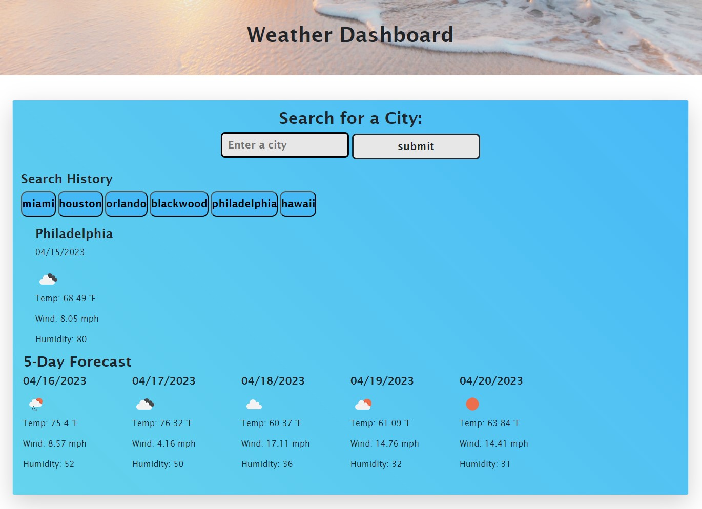

# Weather_Dashboard

## Description
Weather dashboard that will run in the browser.
 

## Link
https://franklynsuriel.github.io/Weather_Dashboard/

## Usage
To use this Weather dashboard webpage, you can open it in a browser. Then, you can search the weather for an expecific city. The search will show you the current weather and a 5 day forecast. Also the search history will be displayed.

The following image shows the web application's appearance and functionality:

## Credits
https://unsplash.com/@oulashin
https://unsplash.com/photos/KMn4VEeEPR8

## License
MIT